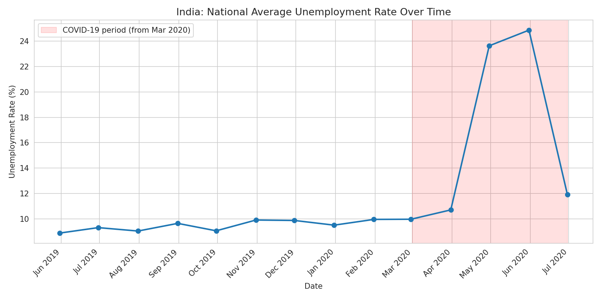
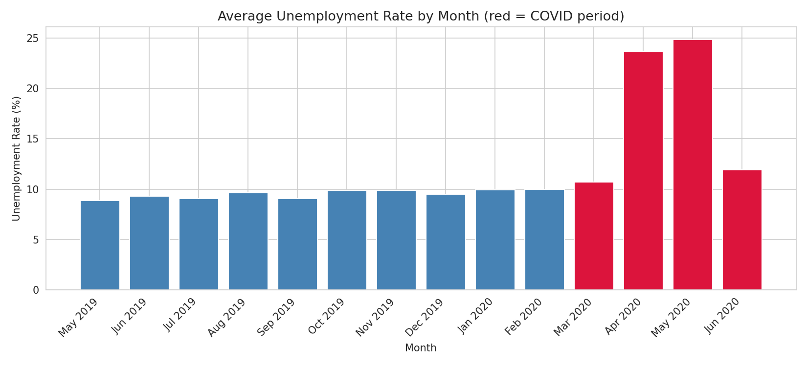
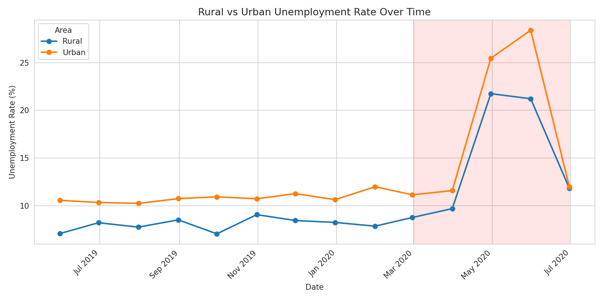
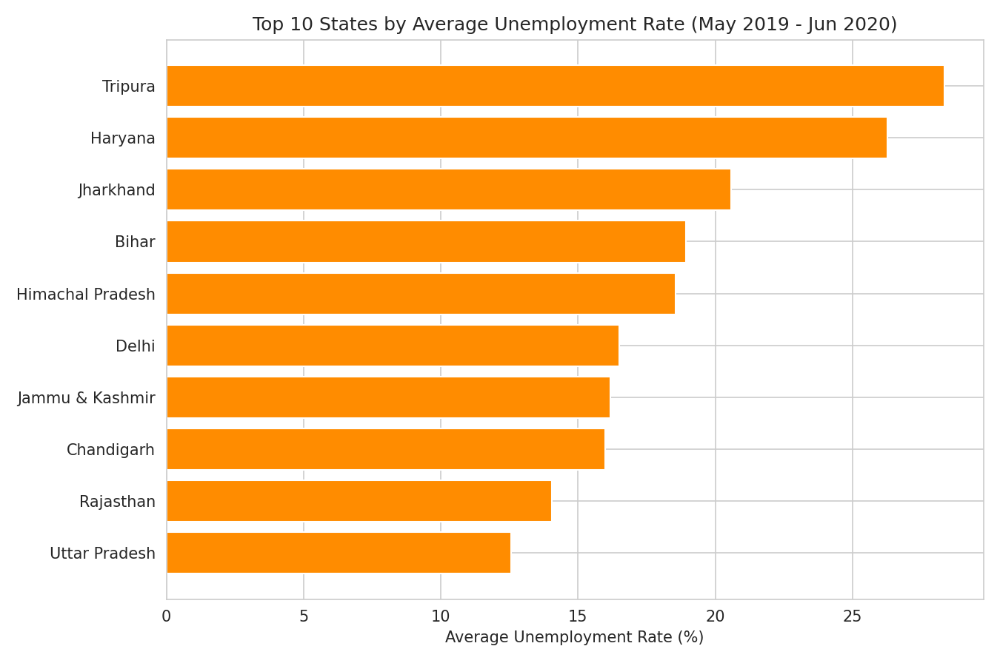
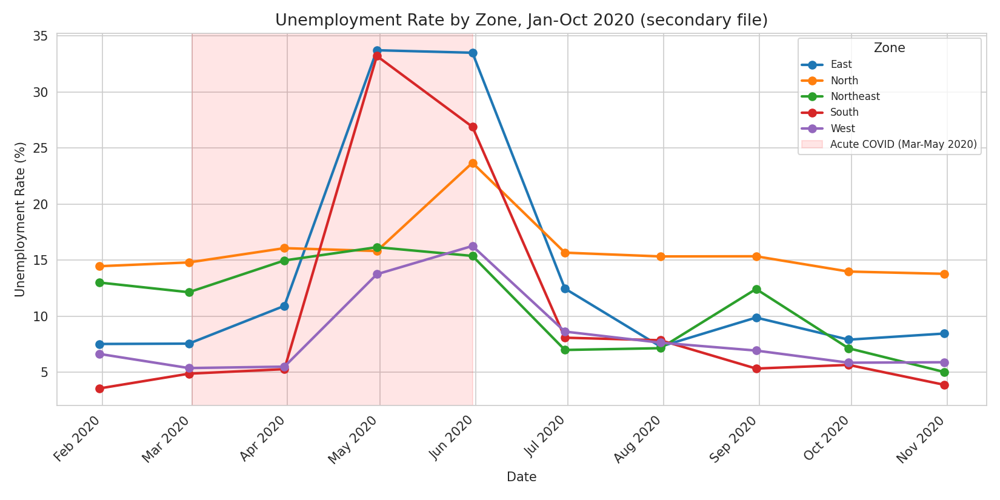

# Task 2 - Unemployment Analysis with Python

## Overview

This project analyzes unemployment trends in India, with a focus on the impact of COVID-19 and regional patterns.

## Technologies

- Python
- Pandas
- NumPy
- Matplotlib
- Seaborn

## Analysis

The project includes:
- Data cleaning
- Exploratory data analysis
- COVID-19 impact analysis
- Rural vs Urban comparison
- Regional comparison
- Seasonal pattern analysis
- Economic and social policy insights

## Visualizations

### Unemployment Rate Over Time

### Monthly Unemployment Rate

### Rural vs Urban

### Top 10 States

### Zone Comparison

